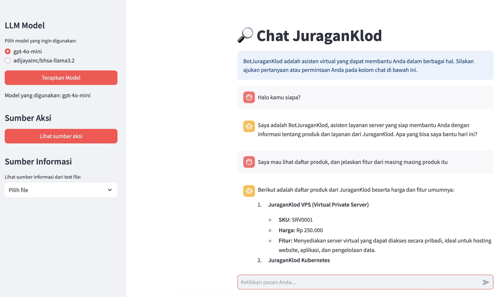
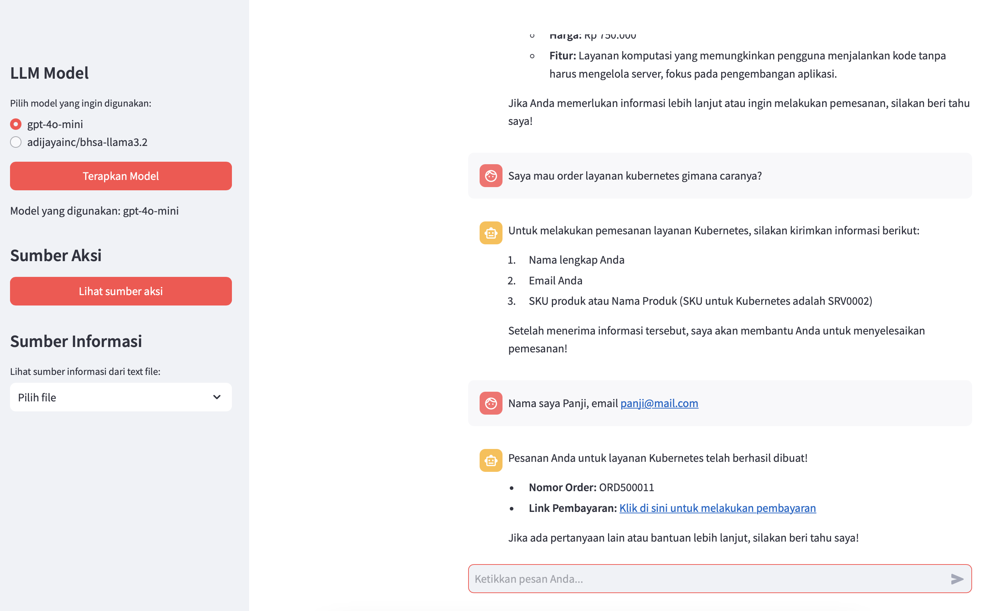
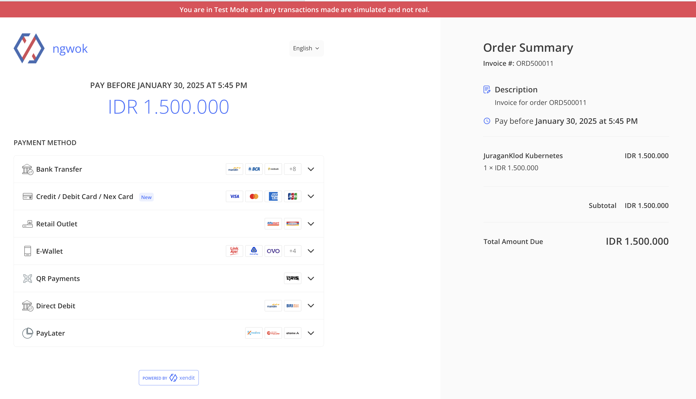
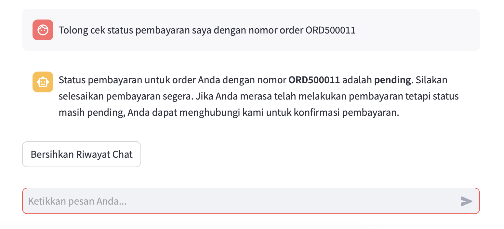
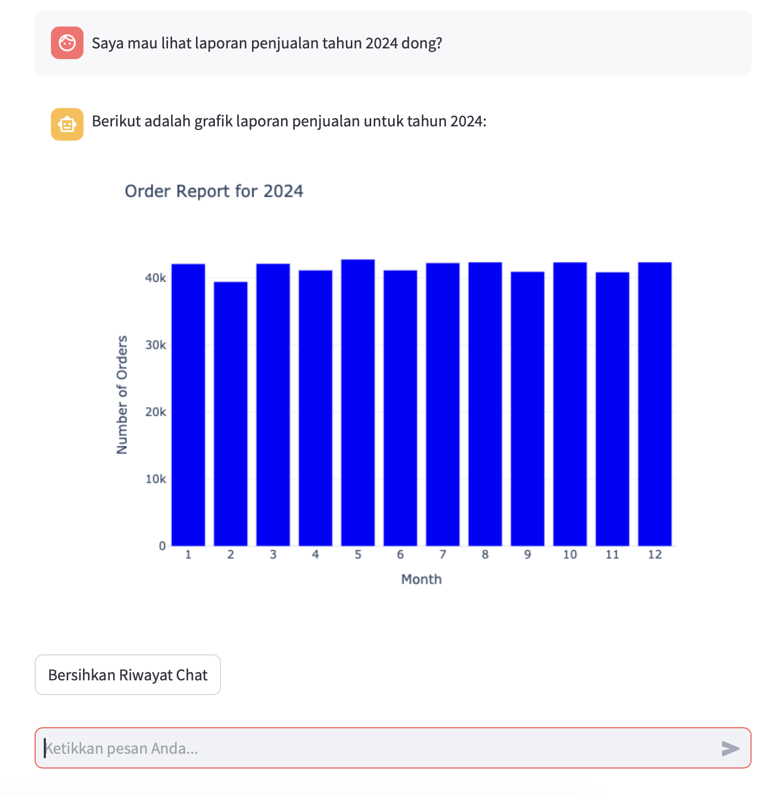

# LLM RAG LangChain



## Description

This project is a prototype agent that uses Large Language Model (LLM) with Retrieval-Augmented Generation (RAG) and various tools to assist with different tasks. The agent is designed to provide relevant and accurate answers based on the given context.

## Features

- **LLM Integration**: Utilizes OpenAI and Ollama models for natural language processing.
- **Retrieval-Augmented Generation (RAG)**: Enhances answer accuracy by retrieving information from relevant documents.
- **Various Tools**: Provides tools for checking orders, creating orders, getting product lists, and more.
- **NLP Semantic for Hybrid Caching**: Uses NLP techniques to semantically compare questions and leverage caching for faster responses.

  > **NOTES:**
  > This project uses NLP techniques to semantically compare questions and leverage caching for faster responses. By normalizing questions using the IndoBERT model and comparing their embeddings, the system can determine if a new question is similar to a previously asked question. If a similar question is found in the cache, the cached response is used, significantly reducing response time and improving efficiency. **However, caching does not apply when the response involves tools that process API requests, as the results are dynamic and may change over time.**

- **Chat Interface**: Interactive chat interface using Streamlit.

## Project Structure

- `app.py`: Main file to run the Streamlit application.
- `llm_model.py`: Manages the LLM models used (OpenAI or Ollama).
- `vector_document.py`: Handles documents and processes them into vectors.
- `vector_store_documents.py`: Stores and retrieves vector documents.
- `tools.py`: Defines various tools used by the agent.
- `llm_invocation.py`: Manages sessions and LLM agent invocation.
- `api_client.py`: Manages communication with external APIs.
- `config.py`: Configuration file for storing environment variables.
- `api`: Contains service functions for tools.

## Installation

1. **Clone the Repository**:

   ```sh
   git clone https://github.com/bonkzero404/LLM-RAG-LangChain.git
   cd LLM-RAG-LangChain
   ```

2. **Create a Virtual Environment**:

   ```sh
   python -m venv env
   source env/bin/activate  # For Mac/Linux users
   # .\env\Scripts\activate  # For Windows users
   ```

3. **Install Dependencies**:

   ```sh
   pip install -r requirements.txt
   ```

4. **Configure Environment Variables**:
   Create a .env file and add the required environment variables:

   ```env
   OPENAI_API_KEY=your_open_ai_key
   DATA_PATH=data/
   OPENAI_MODEL=gpt-4o-mini
   OPENAI_EMBEDDINGS_MODEL=text-embedding-3-large
   OLLAMA_MODEL=qwen2.5:3b
   OLLAMA_EMBEDDINGS_MODEL=snowflake-arctic-embed2
   CHROMA_PATH=./chroma_langchain_sys
   CHROMA_COLLECTION=juragan_klod_collection
   API_URL=http://localhost:5050
   WITH_OLLAMA=false
   QUESTION_THRESHOLD=0.90
   CHAT_USERNAME=your_username
   CHAT_PASSWORD=your_password
   ```

   For a complete configuration of environment variables, refer to the [.env.example](https://github.com/bonkzero404/LLM-RAG-LangChain/blob/main/.env.example) file and [.env.example](https://github.com/bonkzero404/LLM-RAG-LangChain/blob/main/api/.env.example) from api.

5. Insert Chunk Document to Chroma DB

   ```sh
   python import_vectore_store.py
   ```

## Running the Application

1. **Run Fast API**:

   ```sh
   cd api && uvicorn main:app --reload --port 5050
   ```

   Open the OAS http://localhost:5050/docs

2. **Run Streamlit**:

   ```sh
   streamlit run app.py
   ```

3. **Interact with the Agent**:
   Open your browser and access `http://localhost:8501` to start interacting with the agent.

## Usage

- **Chat with the Agent**: Ask questions or make requests in the chat box.
- **Select LLM Model**: Choose the LLM model to use from the sidebar.
- **View Information Sources**: View information sources from the available text files.

## User Interface

1. **Basic Information**
   
2. **Order Services**
   
3. **Integrate to Payment Gateway**
   
4. **Check Order Status**
   
5. **Request Report Orders**
   
